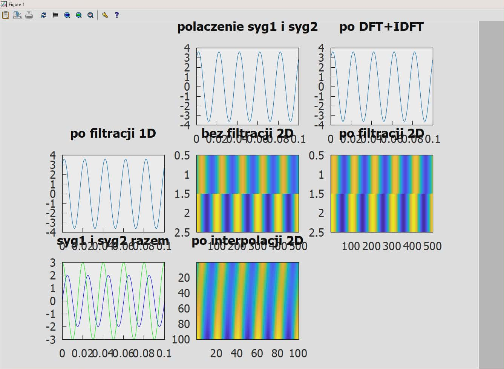

# Projekt 3

Autorki:

* Amelia Lipińska 203721

 

Co zrobić aby projekt się otworzył - instrukcja:

1) Sklonować repozytorium z submodułami:,

   git clone --recurse-submodules https://github.com/Alicja26x/Projekt3.git

   jeśli repozytorium już istnieje:
   git submodule update --init --recursive

2) Wejść do folderu external/vcpkg i uruchomić bootstrap:,

   * Windows: ./bootstrap-vcpkg.bat
   
   * Linux/macOS: ./bootstrap-vcpkg.sh

3) W Anaconda Prompt przejść do folderu projektu i utworzyć środowisko:,

   conda env create --prefix ./envs/projekt3_env --file environment.yml

   conda activate ./envs/projekt3_env

4) Zbudować projekt przy użyciu CMake:,

   Podstawowa komenda:
   cmake -S . -B build -DCMAKE_BUILD_TYPE=Release

   Jeśli wystąpi problem z vcpkg:
   cmake -S . -B build -DCMAKE_BUILD_TYPE=Release -DCMAKE_TOOLCHAIN_FILE=./vcpkg/scripts/buildsystems/vcpkg.cmake

   Następnie uruchomić:
   cmake --build build --config Release

5) Wszystkie zależności zostaną automatycznie zainstalowane do folderu vcpkg_installed

6) Po poprawnym zbudowaniu projektu w katalogu build/Release powinien pojawić się plik signals.pyd

7) W Anaconda Prompt, w katalogu projektu, uruchomić:

   python script.py

8) Należy podać dwa sygnały: typ (sin, cos, square, sawtooth), częstotliwości, amplitudy, t-początkowy i t-końcowy, ilość próbek oraz wykonane w ramach dodatkowego wymagania progowanie sygnału.

9) Pojawią się wyświetlane w gnuplocie wykresy sygnałów:
Oba sygnały osobno, oba zsumowane, DFT,IDFT, filtracja 1D, sygnał przed nałożeniem filtru Gaussa, filtracja 2D, progowanie.

